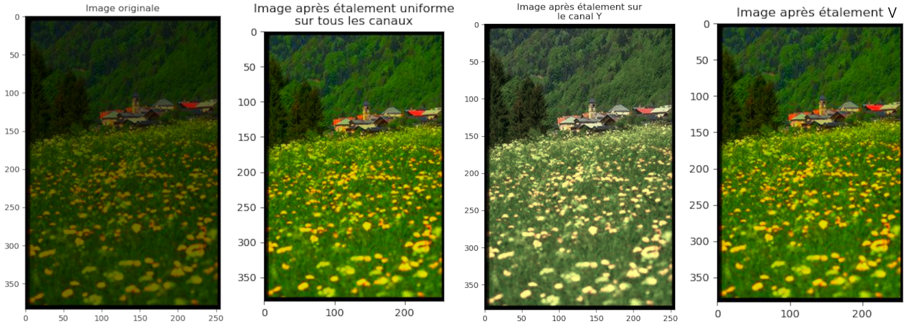
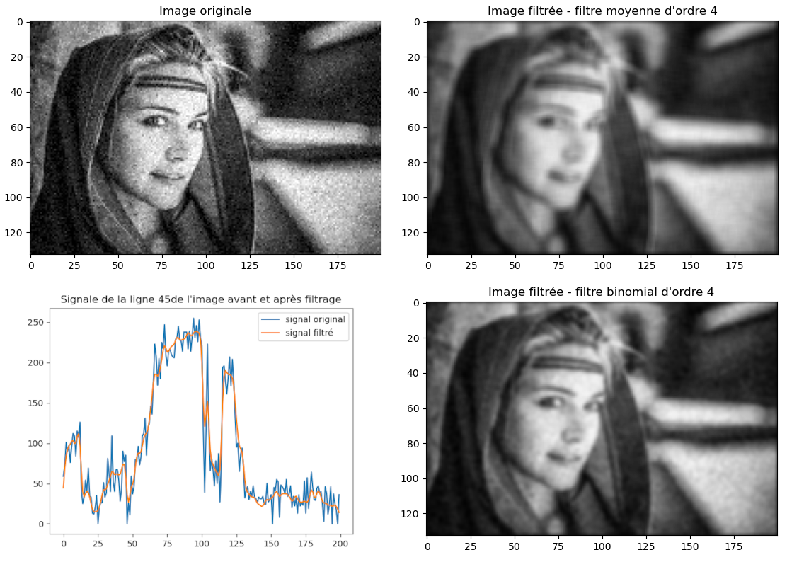
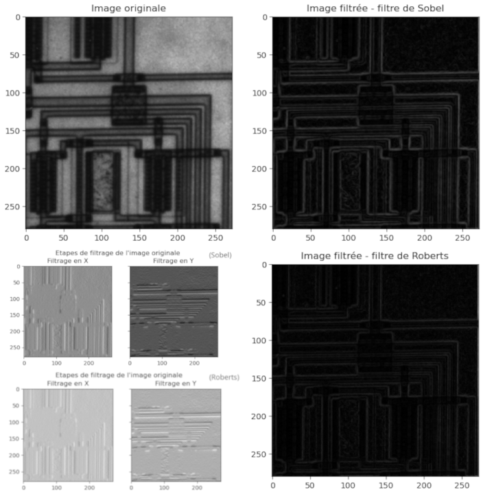
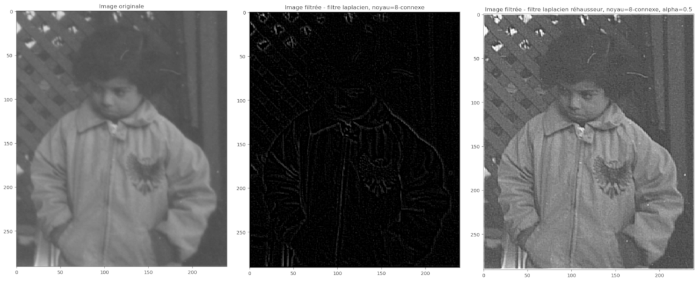

# Traitement_images

## TP1

Commandes lancées pour obtenir les images du dossier resultat :

```
python3 rgb_stretching.py data/foret.png -C -S -H
python3 rgb_stretching.py data/foret.png -C -S -H -e 0 130

python3 ycbcr_stretching.py data/foret.png -C -S -H

python3 hsv_stretching.py data/foret.png -C -S -H -v
python3 hsv_stretching.py data/foret.png -C -S -H -h -e 0 130
python3 hsv_stretching.py data/foret.png -C -H -S -H -s -e 100 250
python3 hsv_stretching.py data/foret.png -C -H -S -H -v -e 0 130
```

Pour s'amuser, faire de même avec l'orque (enlever -H pour ne pas avoir les histogrammes, enlever -C pour ne pas avoir les trois canaux en niveau de gris, adapter le -e en fonction de l'histogramme à étaller)




## TP2

```
Usage : python3 main.py image [-f filtre] [-p parametre(s)_filtre] [-l numero_ligne]
Avec  :
        -f : choisir un filtre parmi :
               o MOYENNE              - paramètres: enier: ordre du noyau
               o GAUSSIEN             - paramètres: float: sigma
               o BINOMIAL             - paramètres: entier: ordre du noyau
               o SOBEL
               o ROBERTS
               o LAPLACIEN            - paramètres: string: 4-connexe | 8-connexe | robinson | binomial
               o LAPLACIEN_REHAUSSEUR - paramètres: string float: idem_prec alpha 
        -l : afficher le signal pour une ligne de l'image
```

Exemples de commandes :

```
python3 main.py data/portrait-n-blanc-bruite.png -f MOYENNE
python3 main.py data/portrait-n-blanc-bruite.png -f MOYENNE -p 2
python3 main.py data/portrait-n-blanc-bruite.png -f MOYENNE -p 3 -l 45

python3 main.py data/portrait-n-blanc-bruite.png -f BINOMIAL -p 3 -l 45
python3 main.py data/portrait-n-blanc-bruite.png -f GAUSSIEN -p 0.5 -l 45
python3 main.py data/portrait-n-blanc-bruite.png -f GAUSSIEN -p 1.5 -l 45

python3 main.py data/portrait-n-blanc-bruite.png -f SOBEL -l 60
python3 main.py data/portrait-n-blanc-bruite.png -f ROBERTS -l 60

python3 main.py data/fillette.png -f LAPLACIEN
python3 main.py data/fillette.png -f LAPLACIEN -p 8-connexe
python3 main.py data/fillette.png -f LAPLACIEN_REHAUSSEUR -p 8-connexe 0.5
```






